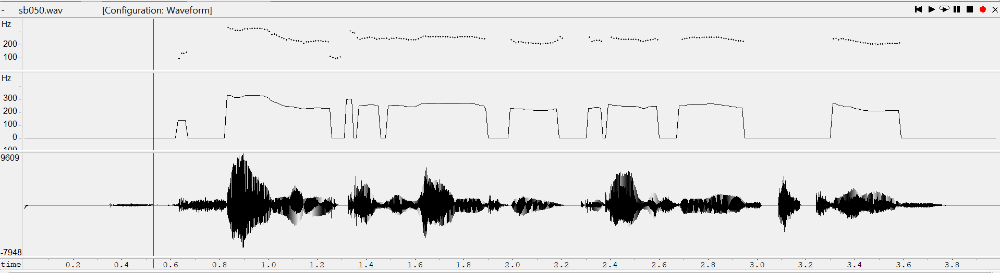
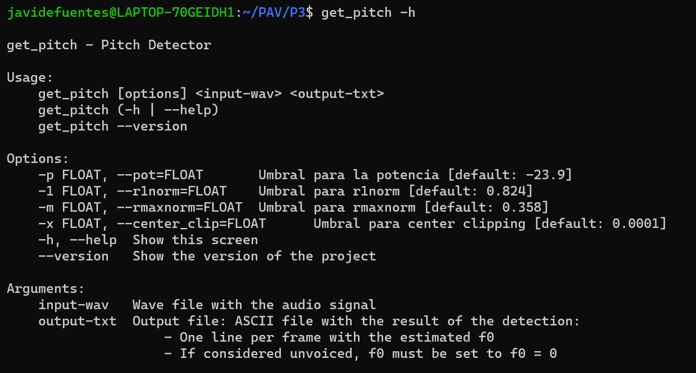

PAV - P3: detección de pitch
============================

Esta práctica se distribuye a través del repositorio GitHub [Práctica 3](https://github.com/albino-pav/P3).
Siga las instrucciones de la [Práctica 2](https://github.com/albino-pav/P2) para realizar un `fork` de la
misma y distribuir copias locales (*clones*) del mismo a los distintos integrantes del grupo de prácticas.

Recuerde realizar el *pull request* al repositorio original una vez completada la práctica.

Ejercicios básicos
------------------

- Complete el código de los ficheros necesarios para realizar la detección de pitch usando el programa
  `get_pitch`.

   * Complete el cálculo de la autocorrelación e inserte a continuación el código correspondiente.
    > El código de la autocorrelación es:
   >
   > ```cpp
  ```cpp
  void PitchAnalyzer::autocorrelation(const vector<float> &x, vector<float> &r) const {

    for (unsigned int l = 0; l < r.size(); ++l) {
      r[l] = 0;
      for (unsigned int n = l; n < x.size(); n++){
        r[l] += x[n-l]*x[n];
      }
    }

    if (r[0] == 0.0F) //to avoid log() and divide zero 
      r[0] = 1e-10; 
  }
  ```
   * Inserte una gŕafica donde, en un *subplot*, se vea con claridad la señal temporal de un segmento de
     unos 30 ms de un fonema sonoro y su periodo de pitch; y, en otro *subplot*, se vea con claridad la
	 autocorrelación de la señal y la posición del primer máximo secundario.

   >Usaremos el audio sb050 ya que por lo general es un audio bastante sonoro

	 NOTA: es más que probable que tenga que usar Python, Octave/MATLAB u otro programa semejante para
	 hacerlo. Se valorará la utilización de la librería matplotlib de Python.

> 

   * Determine el mejor candidato para el periodo de pitch localizando el primer máximo secundario de la
     autocorrelación. Inserte a continuación el código correspondiente.

     >Para encontrar el pitch, lo que hacemos es buscar la diferencia, es decir el lag, entre el >origen y el primer máximo de la autocorrelación. Una vez encontrado, dividimos la >frecuencia de muestreo entre el lag para obtener el pitch
     
    ```cpp

    float PitchAnalyzer::compute_pitch(vector<float> & x) const {
    if (x.size() != frameLen)
      return -1.0F;

    //Window input frame
    for (unsigned int i=0; i<x.size(); ++i)
      x[i] *= window[i];

    vector<float> r(npitch_max);

    //Compute correlation
    autocorrelation(x, r);

    vector<float>::const_iterator iR = r.begin(), iRMax = iR + npitch_min;

    /// \TODO 
	/// Find the lag of the maximum value of the autocorrelation away from the origin.<br>
	/// Choices to set the minimum value of the lag are:
	///    - The first negative value of the autocorrelation.
	///    - The lag corresponding to the maximum value of the pitch.
    ///	   .
	/// In either case, the lag should not exceed that of the minimum value of the pitch.
    /// \DONE Iterando buscamos el valor máximo y asignamos a la variable lag la diferencia entre este máximo y el origen.

    for (vector<float>::const_iterator iR = iRMax; iR < r.end(); iR++) {
      if(*iR > *iRMax) {
        iRMax = iR;
      }
    }
    unsigned int lag = iRMax - r.begin();

    float pot = 10 * log10(r[0]);

    ```

   * Implemente la regla de decisión sonoro o sordo e inserte el código correspondiente.
    
    >Para detectar si el tramo es sonoro o sordo debemos tener en cuenta 2 aspectos. En primer lugar, mirando si la potencia de la sñal es inferior a un umbral podremos confirmar que se trata de un tramo sordo. En segundo lugar, también miraremos las autocorrelación normalizada de la muestra 1 y la autocorrelación normalizada del máximo. Por tanto para detectar si el tramo es sordo o bien, la potencia deberá ser menor al umbral fijado, o el valor de las autocorrelaciones también deberá ser menor al umbral fijado

   ```cpp
   bool PitchAnalyzer::unvoiced(float pot, float r1norm, float rmaxnorm) const {
    /// \TODO Implement a rule to decide whether the sound is voiced or not.
    /// * You can use the standard features (pot, r1norm, rmaxnorm),
    ///   or compute and use other ones.
    /// \DONE Para detectar si es sonoro o no miramos las autocorrelaciones y la potencia 

    if(r1norm < r1norm_umb || rmaxnorm < rmaxnorm_umb || pot < pot_umb)
      return true;
    return false;
  }
  
   ```

- Una vez completados los puntos anteriores, dispondrá de una primera versión del detector de pitch. El 
  resto del trabajo consiste, básicamente, en obtener las mejores prestaciones posibles con él.

  * Utilice el programa `wavesurfer` para analizar las condiciones apropiadas para determinar si un
    segmento es sonoro o sordo. 
	
	  - Inserte una gráfica con la detección de pitch incorporada a `wavesurfer` y, junto a ella, los 
	    principales candidatos para determinar la sonoridad de la voz: el nivel de potencia de la señal
		(r[0]), la autocorrelación normalizada de uno (r1norm = r[1] / r[0]) y el valor de la
		autocorrelación en su máximo secundario (rmaxnorm = r[lag] / r[0]).

		Puede considerar, también, la conveniencia de usar la tasa de cruces por cero.

	    Recuerde configurar los paneles de datos para que el desplazamiento de ventana sea el adecuado, que
		en esta práctica es de 15 ms.

    > 

      - Use el detector de pitch implementado en el programa `wavesurfer` en una señal de prueba y compare
	    su resultado con el obtenido por la mejor versión de su propio sistema.  Inserte una gráfica
		ilustrativa del resultado de ambos detectores.

    >
  
  * Optimice los parámetros de su sistema de detección de pitch e inserte una tabla con las tasas de error
    y el *score* TOTAL proporcionados por `pitch_evaluate` en la evaluación de la base de datos 
	`pitch_db/train`..

  > 

  >Los valores que optimizan nuestra detección de pitch son los siguientes
  
   > - **Potencia** umbral a -23.9.
    >
    > - **Autocorrelación normalizada de 1** umbral a 0.824
    >
    > - **Autocorrelación normalizada en su primer máximo secundario** umbral a 0.358
    >
    > - **Center Clipping** umbral a 0.0001

   * Inserte una gráfica en la que se vea con claridad el resultado de su detector de pitch junto al del
     detector de Wavesurfer. Aunque puede usarse Wavesurfer para obtener la representación, se valorará
	 el uso de alternativas de mayor calidad (particularmente Python).

   > 
   >
   >Podemos apreciar que nuestra aproximación del pitch que ejecuta nuestro programa coincide >casi con total toladidad con la que hace el wavesurfer, por lo que consideramos que hemos realizado un gran trabajo con la detección
    

Ejercicios de ampliación
------------------------

- Usando la librería `docopt_cpp`, modifique el fichero `get_pitch.cpp` para incorporar los parámetros del
  detector a los argumentos de la línea de comandos.
  
  Esta técnica le resultará especialmente útil para optimizar los parámetros del detector. Recuerde que
  una parte importante de la evaluación recaerá en el resultado obtenido en la detección de pitch en la
  base de datos.

  * Inserte un *pantallazo* en el que se vea el mensaje de ayuda del programa y un ejemplo de utilización con los argumentos añadidos.

   > 

   > 


- Implemente las técnicas que considere oportunas para optimizar las prestaciones del sistema de detección
  de pitch.

  Entre las posibles mejoras, puede escoger una o más de las siguientes:

  * Técnicas de preprocesado: filtrado paso bajo, *center clipping*, etc.
  * Técnicas de postprocesado: filtro de mediana, *dynamic time warping*, etc.
  * Métodos alternativos a la autocorrelación: procesado cepstral, *average magnitude difference function*
    (AMDF), etc.
  * Optimización **demostrable** de los parámetros que gobiernan el detector, en concreto, de los que
    gobiernan la decisión sonoro/sordo.
  * Cualquier otra técnica que se le pueda ocurrir o encuentre en la literatura.

  Encontrará más información acerca de estas técnicas en las [Transparencias del Curso](https://atenea.upc.edu/pluginfile.php/2908770/mod_resource/content/3/2b_PS%20Techniques.pdf)
  y en [Spoken Language Processing](https://discovery.upc.edu/iii/encore/record/C__Rb1233593?lang=cat).
  También encontrará más información en los anexos del enunciado de esta práctica.

  Incluya, a continuación, una explicación de las técnicas incorporadas al detector. Se valorará la
  inclusión de gráficas, tablas, código o cualquier otra cosa que ayude a comprender el trabajo realizado.

  También se valorará la realización de un estudio de los parámetros involucrados. Por ejemplo, si se opta
  por implementar el filtro de mediana, se valorará el análisis de los resultados obtenidos en función de
  la longitud del filtro.
  
  >Hemos implementado un preprocesado de *center clipping* con un offset, en el cual, si la señal no supera un cierto umbral, se pone el valor a 0, de esta forma simplificamos la señal para su posterior estudio. El valor escogido ha sido 0.0001, ya que nos maximizaba el porcentaje de detección de pitch


```cpp
   for (unsigned int i = 0; i < x.size(); i++)
  {
    if (abs(x[i]) < center_clip)
      x[i] = 0;
    else if ((x[i] < -1 * center_clip))
    {
      if (x[i] > 0) //Añadimos el offset
        x[i] = x[i] - center_clip;
      else
        x[i] = x[i] + center_clip;
    }
  }
```

>Para el postprocesado hemos implementado un filtro de mediana de 3 coeficientes. éste sirve para eliminar anomalías en el pitch. En la siguiente gráfica que se adjunta se puede ver este fenómeno claramente.

  > 


Evaluación *ciega* del detector
-------------------------------

Antes de realizar el *pull request* debe asegurarse de que su repositorio contiene los ficheros necesarios
para compilar los programas correctamente ejecutando `make release`.

Con los ejecutables construidos de esta manera, los profesores de la asignatura procederán a evaluar el
detector con la parte de test de la base de datos (desconocida para los alumnos). Una parte importante de
la nota de la práctica recaerá en el resultado de esta evaluación.
